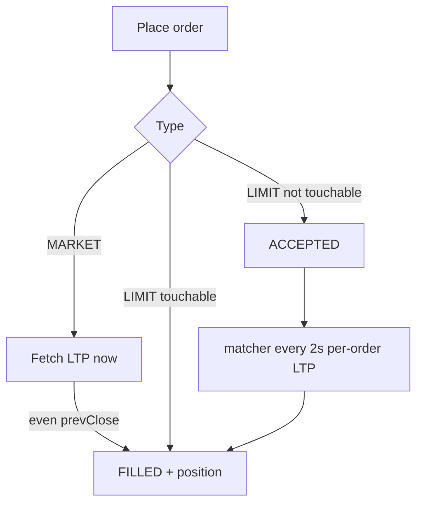
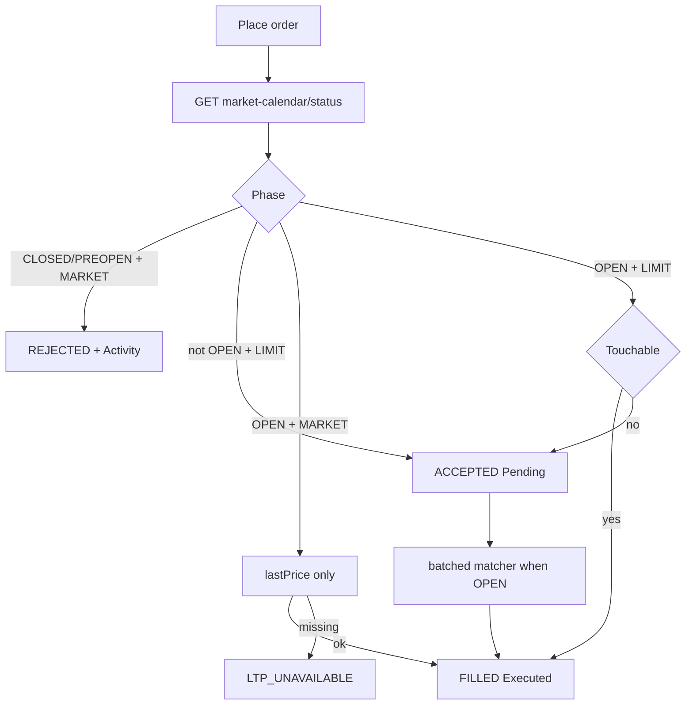

# PLAN — `paper-orders-session`

| Field | Value |
|-------|--------|
| Kind | `feature` |
| Slug | `paper-orders-session` |
| Lead repo | `am-trade-management` (am-oms) |
| Other repos | `am-modern-ui` (`am_paper_ui`); **am-market-data** (consume calendar — already exists); `am-portfolio` only if wallet touch (none expected) |
| Target env | `preprod` |
| Branch | Continue existing: `feature/paper-trading` (am-oms, am-portfolio), `feature/market-paper-desk` (am-modern-ui) — **no new branch from main** |
| Delivery rating | `10/10` (docs refreshed; re-score after Execute) |
| Design rating | `10/10` |
| Scorecard overall | `9.6/10` |
| Agent satisfied | `yes` (docs pack); Execute continues on user Implement |

---

## Goal

Make paper OMS order semantics correct for paper **now** and structurally reusable for live later:

1. Fix after-hours fake **FILLED** (no fill from prevClose).
2. Session-aware MARKET vs LIMIT (and SUPER/TRAIL/STOP).
3. Cancel-all + Orders UX (Executed / Pending / Activity).
4. Per-user order-type favorite (not SUPER for everyone).
5. Matcher **latency isolation** (batch LTP, dedicated client).
6. **Session/holiday from am-market-data** — not a local holiday JSON as source of truth.
7. ExecutionPort seam for future live broker.

Positions only on **FILLED**.

---

## Images

- `images/preview-ticket-order-type-after.png` — ticket default type / CTA Buy at market
- `images/preview-orders-pending-after.png` — Pending + Cancel all
- `images/preview-orders-activity-after.png` — Activity MARKET_CLOSED

Architecture: [`architecture.drawio`](./architecture.drawio) — 7 sheets. **Open BusinessFlow** for the user decision flowchart (MARKET vs LIMIT × session); **Sequence** for happy LIMIT + reject MARKET + cancel-all. Session SoT edge: `GET /v1/market-calendar/status`.

---

## Prerequisites

| Check | Status | Notes |
|-------|--------|--------|
| am-market-data calendar API | **exists** | `GET /v1/market-calendar/status`, `/holidays`, `/timings` |
| OHLC multi-symbol | done | matcher batch |
| Postman OMS | pending | cancel-all, prefs, reject codes + calendar status row |
| Branches | done | paper feature branches only |

---

## Session / holiday source of truth (locked)

**Do not** use OMS-local `holidays_in.json` as SoT.

am-market-data already owns the exchange calendar (Mongo synced from Upstox) via [`MarketCalendarController`](../../../../am-market/am-market-data/market-data-api/src/main/java/com/am/marketdata/api/controller/MarketCalendarController.java):

| Endpoint | Use |
|----------|-----|
| **`GET /v1/market-calendar/status?exchange=NSE`** | **Primary** — live open/closed + reason + `sessionStart`/`sessionEnd` |
| `GET /v1/market-calendar/holidays?exchange=&year=` | Optional list for UI/ops; not required per order |
| `GET /v1/market-calendar/timings?date=&exchange=` | Optional; status already carries today’s window |

### Status → OMS phase mapping

[`MarketStatusResponse`](../../../../am-market/am-market-data/market-data-api/src/main/java/com/am/marketdata/api/model/calendar/MarketStatusResponse.java): `open`, `reason` ∈ `OPEN | WEEKEND | HOLIDAY | HOLIDAY_FALLBACK | OUTSIDE_SESSION`, `sessionStart`, `sessionEnd`.

| Status | OMS phase | MARKET | LIMIT/STOP/TRAIL/SUPER |
|--------|-----------|--------|------------------------|
| `open=true` / reason OPEN | **OPEN** | Fill at **lastPrice** only | Touch fill or rest |
| `open=false`, reason WEEKEND/HOLIDAY/HOLIDAY_FALLBACK | **CLOSED** | Reject `MARKET_CLOSED` | Rest; matcher idle |
| `open=false`, OUTSIDE_SESSION, now &lt; sessionStart | **PREOPEN** | Reject `MARKET_PREOPEN` | Rest; no fill |
| `open=false`, OUTSIDE_SESSION, now ≥ sessionEnd (or no start) | **CLOSED** | Reject `MARKET_CLOSED` | Rest; matcher idle |

### OMS client behavior

- `Clients.market_status(exchange)` → short-timeout call to `/v1/market-calendar/status`.
- **Cache** status ~15–30s in-process (matcher ticks must not stampede).
- On calendar HTTP failure: **fail-safe** — treat as CLOSED for MARKET (reject); resting orders stay ACCEPTED; log `calendar_unavailable`.
- Remove / stop relying on `am_oms/data/holidays_in.json` (delete or leave unused).
- Unit tests: inject fake status clock (no live HTTP).

**am-market-data code change:** none required for calendar (endpoint exists). Verify only under load. New OMS → market path must be documented on Containers sheet.

---

## World-class feature map

### P0 — this slice

- Session via **market-calendar/status** (PREOPEN/OPEN/CLOSED mapping above)
- MARKET: reject closed/preopen; fill only with **lastPrice** when OPEN (never prevClose)
- LIMIT/STOP/TRAIL/SUPER: rest when not OPEN; matcher idle when CLOSED
- Isolated matcher HTTP client + batch LTP (`refresh=false`, ~3s timeout) + tick budget + `matcher_tick` logs
- list_orders: no wallet N+1; optional `from`/`to` (UI default 7d)
- ExecutionPort + PaperExecutionEngine; LIVE stub; matcher `venue=PAPER` only
- `POST /v1/orders/cancel-all` idempotent + OCO reserve release
- Schema locks: `amo`, Investing/CNC-only `productMode`; always set `filledQuantity`
- Prefs `GET/PUT /v1/prefs` orderTypeFavorite
- UI: Executed / Pending / Activity (7d); CTA Buy at market / Place buy; reject toasts; touch helper copy
- Per-user favorite: first-time **MARKET** (not SUPER)

### P1 — next

- Off-process matcher Deployment
- Prefs multi-device polish; UI holiday banner from `/holidays`

### P2 — later

- AMO accept path for live; LiveBrokerGateway; SPAN/MIS; exchange partials; muhurat/auction matching

---

## First-run / virtual value UX

- Paper cash is **virtual**, not live broker money (enable toast).
- Empty Pending until first resting order; Executed empty until first fill.
- Primary path: enable paper → Buy/Sell → ticket uses **user favorite** (first-time MARKET).
- Helper: “Paper fills when price touches your limit.” (paper ≠ exchange book)

---

## Latency & consistency

- Matcher: **dedicated** httpx client (connect 1s / read 3s), `refresh=false`, batch unique symbols, single-flight semaphore, `wait_for` tick budget, skip when phase ≠ OPEN.
- Place MARKET: lastPrice only; miss → `LTP_UNAVAILABLE`.
- Calendar status: cached 15–30s so matcher does not call status every order.
- Pending stays ACCEPTED until OPEN + touch; UI `refreshBooks` after place/cancel.
- Sync lag expectation: fill within matcher interval (~2s) after open + touchable LTP.

---

## How it works today (why FILLED after close)

No session gate; MARKET always tries immediate fill; LIMIT can fill off-hours from stale LTP; matcher shares 30s HTTP client → API starvation.

---

## Target paper behavior

| Order type | Session OPEN | PREOPEN / CLOSED |
|------------|--------------|------------------|
| MARKET | Fill at **lastPrice** only | Reject `MARKET_PREOPEN` / `MARKET_CLOSED` |
| LIMIT / STOP / TRAIL / SUPER | Rest or touch → full FILLED | Rest only; matcher idle if CLOSED |

**CTA:** MARKET → Buy/Sell **at market**; else → **Place buy/sell**.

**Orders UI:**

- **Executed** — FILLED (today / 7d filter)
- **Pending** — ACCEPTED + Cancel + **Cancel all**
- **Activity** — REJECTED + CANCELLED (7d) with reason codes

---

## Current system (verified)

- [`services.py`](../../am-oms/am_oms/services.py): MARKET/_fill_now uses any LTP incl. previousClose; no session gate.
- [`matcher.py`](../../am-oms/am_oms/matcher.py): per-order `ltp`, shared long timeout.
- [`clients.py`](../../am-oms/am_oms/clients.py): OHLC only; **no** calendar client yet (partial session.py may exist — replace SoT with calendar status).
- Market calendar: [`MarketCalendarController`](../../../../am-market/am-market-data/market-data-api/src/main/java/com/am/marketdata/api/controller/MarketCalendarController.java) `/v1/market-calendar/status`.
- Ticket: `orderType = 'SUPER'` hardcoded on desk Buy.
- Orders pane: Today's FILLED + Working; no Activity/cancel-all.

---

## Target journeys

1. Off-hours / holiday MARKET → reject → toast + Activity; no position.
2. Preopen MARKET → `MARKET_PREOPEN`; LIMIT rests.
3. Off-hours LIMIT → Pending; after OPEN + touch → Executed + position.
4. Cancel all Pending → reserves freed; idempotent retry; race-safe vs fill.
5. Buy opens **your** last type; first-time Market; CTA matches type.
6. Open-market OMS stays snappy (batched matcher, calendar cache).

---

## Identity & ownership

- `orderId`, `walletId`, `ownerId`, `idempotencyKey`; prefs keyed by `ownerId`.
- `venue=PAPER`; Kafka fill `portfolioKind=PAPER`.

## State & money

- BUY LIMIT rest reserves cash; cancel/cancel-all releases; fill from reserve.
- Positions only on FILLED (full qty paper).
- Always `filledQuantity` (`0.00` unless filled).

## Isolation

- PAPER book only; LIVE rejected; matcher `venue=PAPER`.
- Calendar is read-only dependency of OMS (no write to market-data).

## Failure modes

| Trigger | System | User sees |
|---------|--------|-----------|
| WEEKEND/HOLIDAY + MARKET | REJECTED MARKET_CLOSED | Toast + Activity |
| PREOPEN + MARKET | REJECTED MARKET_PREOPEN | Toast + Activity |
| No lastPrice while OPEN | LTP_UNAVAILABLE | Toast |
| Calendar HTTP down | Fail-closed MARKET; rest LIMIT | Toast / Pending |
| Matcher timeout | Skip tick | Pending unchanged; API OK |
| Cancel vs fill race | Conditional update | One winner |
| amo=true / MIS product | AMO_NOT_SUPPORTED / PRODUCT_NOT_SUPPORTED | Toast |

---

## Corner-case matrix

| Case | Trigger | Expected | Covered by |
|------|---------|----------|------------|
| Closed MARKET | status closed WEEKEND/HOLIDAY | MARKET_CLOSED | unit (fake status) |
| Preopen MARKET | OUTSIDE_SESSION before start | MARKET_PREOPEN | unit |
| Holiday | status HOLIDAY | CLOSED | unit |
| No lastPrice | open but only prevClose | LTP_UNAVAILABLE | unit |
| Closed LIMIT | not OPEN | ACCEPTED, no fill | unit |
| Cancel-all race | fill wins | cancel skips FILLED | unit |
| OCO cancel | cancel-all | sibling reserves released | unit |
| amo=true | create | AMO_NOT_SUPPORTED | unit |
| MIS product | Intraday | PRODUCT_NOT_SUPPORTED | unit |
| Calendar down | HTTP fail | MARKET reject; LIMIT rest | unit |
| Prefs | PUT then ticket | favorite restored | unit / UI |
| Batch matcher | N symbols | one OHLC call | unit mock |

---

## Services / repos

| Service / repo | Role | Change? |
|----------------|------|---------|
| **am-oms** | Orders, session client→calendar, matcher, cancel-all, prefs | **Yes — primary** |
| **am_paper_ui** | Orders UI, CTA, prefs, toasts | **Yes — primary** |
| **am-market-data** | Calendar SoT + OHLC batch | **Consume existing** `/v1/market-calendar/status` (+ verify OHLC batch). **No new endpoint** unless status missing fields (it does not). |
| **am-oms helm** | matcher timeouts; calendar path if configurable | **Config** |
| **Postman OMS** | cancel-all, prefs, rejects; optional status smoke | **Yes** |
| Kafka fills | fill events | **No** (qty always set) |
| am-portfolio | paper wallet | **No** (branch `feature/paper-trading` if ever) |
| Keycloak / gateway | auth | **No** |
| Live broker / risk | LIVE | **Out of scope** |

Deploy: **am-oms → am-modern-ui** (market-data already deployed with calendar).

---

## Concrete implementation (Execute)

### A. Session from market-calendar

- `Clients.market_status(exchange)` → `GET {AM_MARKET_BASE_URL}/v1/market-calendar/status?exchange=`
- `SessionClock` / PaperExecutionEngine maps status → PREOPEN/OPEN/CLOSED (see table).
- Wire create_order + matcher; drop local holiday JSON SoT.

### B. lastPrice + paper gates

- MARKET open: lastPrice only; closed/preopen reject.
- LIMIT etc.: no immediate touch fill unless OPEN; matcher idle when CLOSED.

### C. Matcher latency

- Dedicated matcher httpx; `ltp_many`; refresh=false; tick budget; venue=PAPER filter; list_orders wallet map; index note `(venue,status,symbol)`.

### D. Cancel-all + schema locks + prefs

- Idempotent cancel-all; OCO reserves; `amo` / productMode; filledQuantity always; GET/PUT prefs.

### E. UI

- Executed / Pending / Activity 7d; Cancel all; CTA; favorite prefs; toasts; touch copy.

### F. Tests

- Fake market status for all session cases; batch matcher; cancel race; prefs.

---

## Out of scope

- Live broker, SPAN/MIS enablement, exchange partials, muhurat auction matching, separate matcher Deployment, AMO accept path.
- Building a **new** market-data calendar endpoint (already have `/status`).

## Open questions

- (none — calendar SoT = `/v1/market-calendar/status`; AMO reject; Investing-only; existing branches)

## Review roles

| Role | When | Looks for |
|------|------|-----------|
| Agent architect | Until satisfied | Scorecard, draw.io, corners, calendar wiring |
| You | Review / Implement | First-run, P0, previews, holiday via market-data |
| Optional `/review` | If asked | am-code-review |

## UI previews (modern-ui)

- Gate: **pass**
- **Orders DoD mock:** [`order.png`](./order.png) — unified Today's orders (see [`UI-ORDERS.md`](./UI-ORDERS.md))
- Previews: see Images above (ticket / pending / activity); replace Orders pane to match `order.png`

## Test Plan (Postman / MCP)

| Row | Request | Expected | Owning |
|-----|---------|----------|--------|
| 1 | GET market-calendar/status | open/reason present | am-market-data |
| 2 | POST MARKET when closed | MARKET_CLOSED | am-oms |
| 3 | POST LIMIT when closed | ACCEPTED | am-oms |
| 4 | POST cancel-all | cancelled≥0 | am-oms |
| 5 | PUT/GET prefs | orderTypeFavorite | am-oms |
| 6 | GET orders?from&to | 7d items | am-oms |

## Deploy

preprod: am-oms then am-modern-ui.

## Agent scorecard

| Dimension | Score | Evidence |
|-----------|-------|----------|
| Product / features | 9.5 | Full P0 + first-run + previews |
| Architecture / design | 9.5 | draw.io + calendar SoT |
| Data / identity / contracts | 9.5 | prefs, amo, filledQuantity, status DTO |
| State / money / consistency | 9.5 | reserve/cancel-all |
| Reliability / failure | 9.5 | calendar fail-safe + matcher isolation |
| Security / authz | 9.0 | owner/wallet |
| Observability | 9.5 | matcher_tick + calendar_unavailable |
| Testability | 9.5 | corner matrix |
| Operability / rollout | 9.5 | existing branches |
| TODO / implementability | 9.5 | TODO.md |
| **Overall** | **9.6** | |

## Adversarial review

| Severity | Finding |
|----------|---------|
| Minor | Paper touch ≠ exchange book — documented |
| Minor | Status cache may lag ≤30s around open bell — acceptable |

- Blocker/Major: 0

## User review gate

User asked to enrich this PLAN + use market-data calendar; Execute continues after confirm of this refresh.

## REPORT gate

`REPORT.md` only after unit + Test Plan verified.
