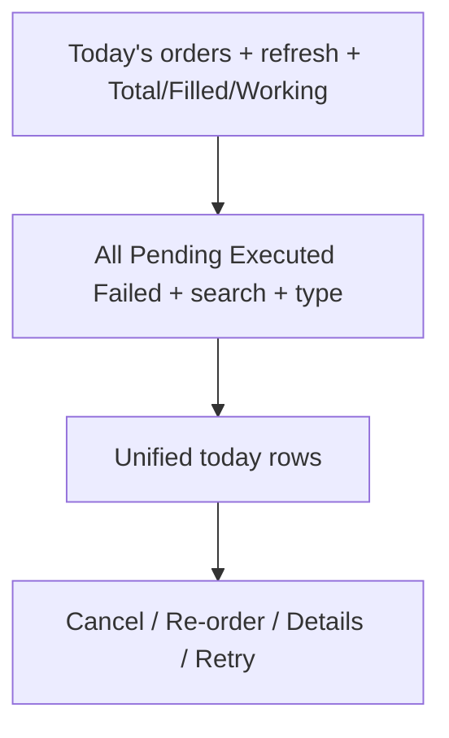

# UI plan — Paper Orders pane (`order.png` target)

Branch: `feature/market-paper-desk` (`am-modern-ui`).  
Target mock: [`order.png`](./order.png) / [`images/orders-target-ui.png`](./images/orders-target-ui.png).  
Current: split “Today's orders” (FILLED only) + “Working orders” list in [`paper_orders_pane.dart`](../../am-modern-ui/am_paper_ui/lib/presentation/widgets/paper_orders_pane.dart).

## Gap

| Area | Current | Target (`order.png`) |
|------|---------|----------------------|
| Layout | Two sections | **One** unified table |
| Filters | None | All / Pending·Working / Executed / Failed·Cancelled + counts |
| Stats | None | Total / Filled / Working chips |
| Search | None | Symbol search + All Types dropdown |
| Side | Green text | BUY/SELL outline chips |
| Symbol | Plain | Symbol + **NSE** badge (+ CNC if known) |
| Qty | Filled only | Working `0 / qty`; filled = qty |
| Status | Grey `FILLED` | Pills: OPEN (yellow), FILLED (green), REJECTED (red); map `ACCEPTED`→**OPEN** |
| Actions | Cancel on working only | OPEN: Cancel; FILLED: Re-order; REJECTED: Details + Retry |
| Cancel all | Missing | Header when pending &gt; 0 |
| Modify | — | **Skip** until OMS replace exists |

## Implement (am_paper_ui only)

1. **Model** — Today = FILLED|ACCEPTED|REJECTED|CANCELLED created today; display OPEN for ACCEPTED; qty/price helpers; `isCancelled`.
2. **Chrome** — Stats chips; filter chips; search; type dropdown; Cancel all.
3. **Table/cards** — Side chips, NSE badge, status pills, Actions column; mobile same filters (drop Working footer).
4. **Actions** — Cancel → cubit; Re-order/Retry → open ticket prefilled; Details → rejectReason dialog.
5. **Toasts** — `MARKET_CLOSED` / `MARKET_PREOPEN` in `omsRejectMessage`.

## Out of scope

Modify/replace API; fake MIS/NRML; multi-day history; OMS session/matcher (separate).

## DoD

Orders tab visually matches `order.png` structure (filters, stats, unified rows, pills, actions) on paper desk web + mobile cards.
