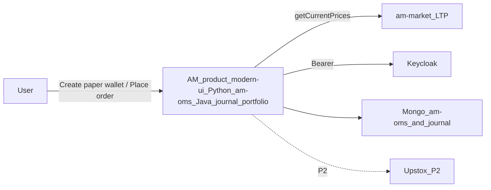
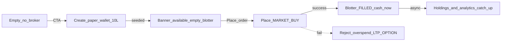
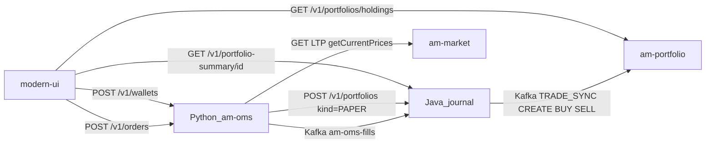

# architecture.drawio source (Python OMS)

**Status:** Disk [`architecture.drawio`](architecture.drawio) is the 7-sheet Python `am-oms` file (Context / BusinessFlow / Containers / Sequence / DataIdentity / SecurityTrust / Failures). This markdown is a readable companion, not a stale override.

## 1. Context

## 2. BusinessFlow

## 3. Containers (labeled edges)

## 4. Sequence

1. UI → Python `POST /v1/wallets`
2. Python → Java `POST /v1/portfolios kind=PAPER`
3. Java → portfolio `TRADE_SYNC CREATE`
4. UI → Python `POST /v1/orders` MARKET BUY
5. Python → market `getCurrentPrices`
6. Python → Java Kafka `am-oms-fills`
7. Java → portfolio `TRADE_SYNC BUY`
8. Reject: UI → Python overspend `REJECTED` (no Kafka)

## 5–7. Data / Security / Failures

- Python: walletId, available/reserved, orderId, idempotencyKey, portfolioUuid
- Java: portfolio UUID kind=PAPER, tradeId, sourceOrderId
- Events: OrderFillEvent then TRADE_SYNC (UUID vs name split)
- Bearer on HTTP; Kafka verifies ownerId; PAPER ≠ BROKER; owner-summary omits PAPER
- Failures: LTP, overspend, OPTION/LIVE/LIMIT, Java 502 no wallet, Kafka lag, kind/owner skip

The XML lives in [`architecture.drawio`](architecture.drawio). Do not paste an older am-trading file over it.
